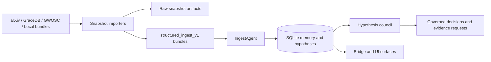

# Manatuabon

[](https://github.com/drosadocastro-bit/Manatuabon/actions/workflows/regressions.yml)

Manatuabon is an offline-first, human-governed astrophysics reasoning workspace. It combines structured evidence ingest, a hypothesis council, and a local memory/database layer so new material can be reviewed with provenance instead of being treated as autonomous truth.

## Core Direction

- Offline-first by default: the runtime is designed to keep working with local models, local SQLite state, and fetch-and-freeze evidence snapshots.
- Governed review instead of freeform synthesis: hypotheses pass through explicit review agents and evidence policy checks.
- Provenance-rich ingest: external sources are normalized into `structured_ingest_v1` bundles before entering the memory system.

## Architecture



The design intent is simple: external evidence is frozen first, normalized second, and only then allowed to influence memory or hypothesis review.

## Main Components

- `manatuabon_agent.py`: ingest agent, memory manager, watcher, and bridge-facing runtime logic.
- `hypothesis_council.py`: governed review flow, evidence policy, quant review, reflection, and decision persistence.
- `pulsar_glitch_importer.py`: structured pulsar glitch evidence ingest and canonical hypothesis seeding.
- `pulsar_recovery_paper_importer.py`: structured ingest for the Vela recovery paper evidence bundle.
- `arxiv_snapshot_importer.py`: fetch-and-freeze arXiv metadata snapshots with optional direct DB ingest.
- `gracedb_snapshot_importer.py`: fetch-and-freeze GraceDB event and superevent snapshots with optional direct DB ingest.
- `gwosc_snapshot_importer.py`: fetch-and-freeze GWOSC released event-version snapshots with optional direct DB ingest.
- `openuniverse_snapshot_importer.py`: ingest synthetic dataset manifests as anomaly-detection benchmark bundles without treating them as direct observational evidence.
- `gw_public_presets.json`: public gravitational-wave fetch presets for validated GraceDB and GWOSC entry points.
- `synthetic_data_presets.json`: synthetic benchmark presets for anomaly-detection and calibration workflows.

## Quick Start

Detailed setup notes live in [SETUP.md](SETUP.md).

Typical local bootstrap on Windows PowerShell:

```powershell
py -3.13 -m venv .venv
.\.venv\Scripts\Activate.ps1
python -m pip install --upgrade pip
python -m pip install -r requirements.txt
python .\db_init.py
```

Start the main stack:

```powershell
.\start_manatuabon.ps1
```

## Governed Snapshot Ingest

The snapshot importers all follow the same pattern:

1. Fetch authoritative source metadata.
2. Write a raw snapshot artifact for auditability.
3. Write a normalized `structured_ingest_v1` bundle.
4. Optionally ingest the bundle directly into `manatuabon.db`.

Use `--evidence-only` when you want provenance in memory without seeding a new `AUTO-*` hypothesis.

Examples:

```powershell
python .\arxiv_snapshot_importer.py --query 'all:"gravitational wave"+AND+submittedDate:[202501010000+TO+202612312359]' --max-results 1 --page-size 1 --inbox D:/Manatuabon/data --db D:/Manatuabon/manatuabon.db --agent-log D:/Manatuabon/agent_log.json --ingest --evidence-only

python .\gracedb_snapshot_importer.py --superevent-id S190425z --force-noauth --inbox D:/Manatuabon/data --db D:/Manatuabon/manatuabon.db --agent-log D:/Manatuabon/agent_log.json --ingest --evidence-only

python .\gwosc_snapshot_importer.py --event-version GW241110_124123-v1 --inbox D:/Manatuabon/data --db D:/Manatuabon/manatuabon.db --agent-log D:/Manatuabon/agent_log.json --ingest --evidence-only

python .\openuniverse_snapshot_importer.py --dataset openuniverse2024 --inbox D:/Manatuabon/data --db D:/Manatuabon/manatuabon.db --agent-log D:/Manatuabon/agent_log.json --ingest
```

## Synthetic Anomaly Benchmarks

Manatuabon now supports a separate synthetic-data ingest path for anomaly detection work. This is for simulation products such as OpenUniverse, where the right use is benchmarking, calibration, and false-positive control rather than claim support.

The importer writes a structured bundle with explicit synthetic-data context and defaults to no new hypothesis generation.

Recommended uses:

- test Roman versus Rubin cross-survey anomaly features before applying them to real observations
- benchmark image and catalog alignment logic against known synthetic inputs
- calibrate anomaly scoring thresholds without contaminating council evidence tiers

## Testing

The repository now includes a deterministic regression workflow at [.github/workflows/regressions.yml](.github/workflows/regressions.yml). It runs on `push` and `pull_request` and covers the importer and council regression scripts that do not depend on live services or a manual workstation database.

The CI suite currently runs:

- `test_arxiv_snapshot_importer.py`
- `test_gracedb_snapshot_importer.py`
- `test_gwosc_snapshot_importer.py`
- `test_openuniverse_snapshot_importer.py`
- `test_pulsar_glitch_importer.py`
- `test_pulsar_recovery_paper_importer.py`
- `test_council_evidence_policy.py`
- `test_council_evidence_requests.py`
- `test_council_quant_reviewer.py`
- `test_council_reflection.py`
- `test_council_graph.py`
- `test_watcher_handler.py`

The following tests are intentionally not part of CI right now because they are workstation-specific or long-running:

- `test_governance_controls.py`
- `test_worker_retries.py`

Run the deterministic suite locally with:

```powershell
python .\test_arxiv_snapshot_importer.py
python .\test_gracedb_snapshot_importer.py
python .\test_gwosc_snapshot_importer.py
python .\test_openuniverse_snapshot_importer.py
python .\test_pulsar_glitch_importer.py
python .\test_pulsar_recovery_paper_importer.py
python .\test_council_evidence_policy.py
python .\test_council_evidence_requests.py
python .\test_council_quant_reviewer.py
python .\test_council_reflection.py
python .\test_council_graph.py
python .\test_watcher_handler.py
```

## Runtime Notes

- LM Studio is still required for live Nemotron-backed query and ingest paths.
- Structured evidence bundles do not require LLM parsing and are preferred for auditable ingest.
- GraceDB is useful for analyst workflow context when public objects are accessible.
- GWOSC is preferable for released, DOI-backed public gravitational-wave metadata.
- OpenUniverse-style synthetic datasets are best used for anomaly-detection benchmarking and pipeline calibration, not as direct council evidence.