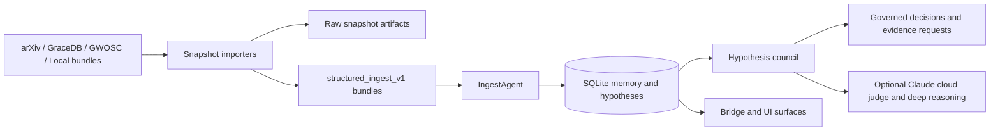

# Manatuabon

[](https://github.com/drosadocastro-bit/Manatuabon/actions/workflows/regressions.yml)

Manatuabon is a local-first, human-governed astrophysics reasoning workspace with optional Claude cloud escalation for deep review. It combines structured evidence ingest, a hypothesis council, and a local memory/database layer so new material can be reviewed with provenance instead of being treated as autonomous truth.

## Core Direction

- Local-first hybrid runtime: the core workflow keeps working with local models, local SQLite state, and fetch-and-freeze evidence snapshots, while selected deep-review paths can escalate to Claude when explicitly configured.
- Governed review instead of freeform synthesis: hypotheses pass through explicit review agents and evidence policy checks.
- Provenance-rich ingest: external sources are normalized into `structured_ingest_v1` bundles before entering the memory system.

## Architecture



The design intent is simple: external evidence is frozen first, normalized second, and only then allowed to influence memory or hypothesis review.

## Main Components

- `manatuabon_agent.py`: ingest agent, memory manager, watcher, and bridge-facing runtime logic.
- `hypothesis_council.py`: governed review flow, evidence policy, quant review, reflection, and decision persistence.
- `pulsar_glitch_importer.py`: structured pulsar glitch evidence ingest and canonical hypothesis seeding.
- `pulsar_recovery_paper_importer.py`: structured ingest for the Vela recovery paper evidence bundle.
- `arxiv_snapshot_importer.py`: fetch-and-freeze arXiv metadata snapshots with optional direct DB ingest.
- `gracedb_snapshot_importer.py`: fetch-and-freeze GraceDB event and superevent snapshots with optional direct DB ingest.
- `gwosc_snapshot_importer.py`: fetch-and-freeze GWOSC released event-version snapshots with optional direct DB ingest.
- `mast_snapshot_importer.py`: fetch-and-freeze real JWST and HST observation metadata from MAST with optional direct DB ingest.
- `gaia_snapshot_importer.py`: fetch-and-freeze real Gaia DR3 astrometric and kinematic snapshots with optional direct DB ingest.
- `panstarrs_snapshot_importer.py`: fetch-and-freeze real Pan-STARRS DR2 catalog snapshots from MAST with optional direct DB ingest.
- `sdss_snapshot_importer.py`: fetch-and-freeze real SDSS catalog snapshots with SQL-to-radial fallback and optional direct DB ingest.
- `ztf_snapshot_importer.py`: fetch-and-freeze real ZTF science-frame metadata from IRSA with optional direct DB ingest.
- `gaia_sdss_anomaly_worker.py`: cross-match governed Gaia and SDSS bundles into deterministic observational anomaly-triage bundles.
- `gaia_panstarrs_anomaly_worker.py`: cross-match governed Gaia and Pan-STARRS bundles into deterministic observational anomaly-triage bundles.
- `gaia_ztf_anomaly_worker.py`: cross-match governed Gaia and ZTF bundles into deterministic follow-up triage bundles.
- `openuniverse_snapshot_importer.py`: ingest synthetic dataset manifests as anomaly-detection benchmark bundles without treating them as direct observational evidence.
- `anomaly_benchmark_worker.py`: derive deterministic anomaly-benchmark scoring bundles from synthetic structured ingest files before touching observational streams.
- `cross_survey_catalog_anomaly_worker.py`: cross-match local synthetic catalogs, compute positional and flux residuals, and write deterministic anomaly bundles for benchmark tuning.
- `replay_manifest.py`: replay a saved manifest of bundle paths through deterministic cross-match workers for reproducible analysis packages.
- `analysis_export.py`: export cross-match anomaly profiles as flat CSV and markdown summary tables suitable for paper supplementary material.
- `extinction_lookup.py`: Galactic extinction E(B-V) lookup and per-band dereddening using Schlafly & Finkbeiner 2011 coefficients with dustmaps SFD or analytical csc(|b|) fallback.
- `gw_public_presets.json`: public gravitational-wave fetch presets for validated GraceDB and GWOSC entry points.
- `synthetic_data_presets.json`: synthetic benchmark presets for anomaly-detection and calibration workflows.

## Quick Start

Detailed setup notes live in [SETUP.md](SETUP.md). A full step-by-step usage guide lives in [WALKTHROUGH.md](WALKTHROUGH.md).

Typical local bootstrap on Windows PowerShell:

```powershell
py -3.13 -m venv .venv
.\.venv\Scripts\Activate.ps1
python -m pip install --upgrade pip
python -m pip install -r requirements.txt
python .\db_init.py
```

Start the main stack:

```powershell
.\start_manatuabon.ps1
```

## Governed Snapshot Ingest

The snapshot importers all follow the same pattern:

1. Fetch authoritative source metadata.
2. Write a raw snapshot artifact for auditability.
3. Write a normalized `structured_ingest_v1` bundle.
4. Optionally ingest the bundle directly into `manatuabon.db`.

Use `--evidence-only` when you want provenance in memory without seeding a new `AUTO-*` hypothesis.

Examples:

```powershell
python .\arxiv_snapshot_importer.py --query 'all:"gravitational wave"+AND+submittedDate:[202501010000+TO+202612312359]' --max-results 1 --page-size 1 --inbox D:/Manatuabon/data --db D:/Manatuabon/manatuabon.db --agent-log D:/Manatuabon/agent_log.json --ingest --evidence-only

python .\gracedb_snapshot_importer.py --superevent-id S190425z --force-noauth --inbox D:/Manatuabon/data --db D:/Manatuabon/manatuabon.db --agent-log D:/Manatuabon/agent_log.json --ingest --evidence-only

python .\gwosc_snapshot_importer.py --event-version GW241110_124123-v1 --inbox D:/Manatuabon/data --db D:/Manatuabon/manatuabon.db --agent-log D:/Manatuabon/agent_log.json --ingest --evidence-only

python .\openuniverse_snapshot_importer.py --dataset openuniverse2024 --inbox D:/Manatuabon/data --db D:/Manatuabon/manatuabon.db --agent-log D:/Manatuabon/agent_log.json --ingest
```

## Synthetic Anomaly Benchmarks

Manatuabon now supports a separate synthetic-data ingest path for anomaly detection work. This is for simulation products such as OpenUniverse, where the right use is benchmarking, calibration, and false-positive control rather than claim support.

The importer writes a structured bundle with explicit synthetic-data context and defaults to no new hypothesis generation.

Once a synthetic bundle exists, derive a deterministic anomaly-benchmark profile from it:

```powershell
python .\anomaly_benchmark_worker.py --bundle D:/Manatuabon/data/openuniverse_snapshot_bundle_openuniverse2024_YYYYMMDD_HHMMSS.json --inbox D:/Manatuabon/data --db D:/Manatuabon/manatuabon.db --agent-log D:/Manatuabon/agent_log.json --ingest
```

This worker scores benchmark readiness from metadata that is actually present in the synthetic bundle: Roman/Rubin pairing, truth-product hints, calibration-stage coverage, public accessibility, and onboarding support. It does not pretend to perform image-level anomaly detection from manifest text alone.

Once you have actual local synthetic catalogs, run the feature extractor stage on those catalogs directly:

Before running the feature extractor, normalize raw OpenUniverse-style exports into the exact row shape the worker expects:

```powershell
python .\openuniverse_catalog_normalizer.py --input D:/Manatuabon/data/roman_export.json --catalog-name Roman --out-dir D:/Manatuabon/data --format both
python .\openuniverse_catalog_normalizer.py --input D:/Manatuabon/data/rubin_export.json --catalog-name Rubin --out-dir D:/Manatuabon/data --format both
python .\openuniverse_catalog_normalizer.py --input D:/Manatuabon/data/truth_export.json --catalog-name Truth --out-dir D:/Manatuabon/data --format both
```

The normalizer auto-detects common OpenUniverse-style aliases such as `object_id`, `ra_deg`, `dec_deg`, `flux_mjy`, `mag_ab`, and `axis_ratio`, then writes exact `id, ra, dec, flux, mag, shape` rows plus a metadata sidecar showing which original columns were resolved.

If you want the whole synthetic catalog path in one command, run the pipeline wrapper instead:

```powershell
python .\openuniverse_catalog_pipeline.py --roman D:/Manatuabon/data/roman_export.json --rubin D:/Manatuabon/data/rubin_export.json --truth D:/Manatuabon/data/truth_export.json --out-dir D:/Manatuabon/data --normalized-format both --max-sep-arcsec 1.0 --db D:/Manatuabon/manatuabon.db --agent-log D:/Manatuabon/agent_log.json --ingest
```

This wrapper runs normalization for Roman, Rubin, and Truth, writes the normalized catalog files, then immediately runs `cross_survey_catalog_anomaly_worker.py` on the standardized rows and returns a JSON summary of all output paths plus the match summary.

```powershell
python .\cross_survey_catalog_anomaly_worker.py --left D:/Manatuabon/data/roman_catalog.csv --right D:/Manatuabon/data/rubin_catalog.csv --truth D:/Manatuabon/data/truth_catalog.csv --left-name Roman --right-name Rubin --truth-name Truth --max-sep-arcsec 1.0 --inbox D:/Manatuabon/data --db D:/Manatuabon/manatuabon.db --agent-log D:/Manatuabon/agent_log.json --ingest
```

This is the first stage that works on actual extracted source rows rather than registry metadata. It computes cross-match fraction, positional residuals, flux or magnitude residuals, truth overlap, and a ranked anomaly-candidate list while still keeping synthetic results outside council confidence scoring.

Recommended uses:

- test Roman versus Rubin cross-survey anomaly features before applying them to real observations
- benchmark image and catalog alignment logic against known synthetic inputs
- calibrate anomaly scoring thresholds without contaminating council evidence tiers

## Real Observational Archives

The real-data side should stay provenance-first and separate from synthetic calibration. Manatuabon now has a governed MAST snapshot importer for actual JWST and HST observation metadata, and the broader archive roadmap is tracked in `real_archive_presets.json`.

Example MAST ingest:

```powershell
python .\mast_snapshot_importer.py --target M87 --collections JWST,HST --radius-deg 0.05 --inbox D:/Manatuabon/data --db D:/Manatuabon/manatuabon.db --agent-log D:/Manatuabon/agent_log.json --ingest --evidence-only
```

Example Gaia ingest:

```powershell
python .\gaia_snapshot_importer.py --ra-center 266.4168 --dec-center -29.0078 --radius-deg 0.5 --max-results 100 --inbox D:/Manatuabon/data --db D:/Manatuabon/manatuabon.db --agent-log D:/Manatuabon/agent_log.json --ingest --evidence-only
```

Example SDSS ingest:

```powershell
python .\sdss_snapshot_importer.py --ra-center 266.4168 --dec-center -29.0078 --radius-arcmin 60 --max-results 50 --object-type galaxy --inbox D:/Manatuabon/data --db D:/Manatuabon/manatuabon.db --agent-log D:/Manatuabon/agent_log.json --ingest --evidence-only
```

The SDSS importer now retries more defensively on sparse fields: if the typed PhotoObj query returns zero rows, it retries a relaxed SQL query without the object-type filter, then a spectroscopic `SpecObj` join, before dropping to radial search.

Example Pan-STARRS ingest:

```powershell
python .\panstarrs_snapshot_importer.py --ra-center 210.802429 --dec-center 54.348750 --radius-deg 0.05 --max-results 50 --min-detections 1 --inbox D:/Manatuabon/data --db D:/Manatuabon/manatuabon.db --agent-log D:/Manatuabon/agent_log.json --ingest --evidence-only
```

The Pan-STARRS importer also broadens sparse-field live retrieval: it starts with the DR2 mean catalog, relaxes the detection threshold if needed, and then switches to the DR2 stack catalog with a broader radius when the strict mean query returns nothing.

When projected Pan-STARRS queries return schema metadata plus array-valued rows instead of object dictionaries, the importer now hydrates those rows deterministically before normalization so the stored bundle remains auditable and reproducible.

Example ZTF ingest:

```powershell
python .\ztf_snapshot_importer.py --ra-center 255.57691 --dec-center 12.28378 --size-deg 0.1 --max-results 50 --intersect OVERLAPS --inbox D:/Manatuabon/data --db D:/Manatuabon/manatuabon.db --agent-log D:/Manatuabon/agent_log.json --ingest --evidence-only
```

Example Gaia x SDSS anomaly triage:

```powershell
python .\gaia_sdss_anomaly_worker.py --gaia-bundle D:/Manatuabon/data/gaia_snapshot_bundle_<label>.json --sdss-bundle D:/Manatuabon/data/sdss_snapshot_bundle_<label>.json --max-sep-arcsec 30 --pm-threshold-masyr 10 --redshift-threshold 0.05 --inbox D:/Manatuabon/data --db D:/Manatuabon/manatuabon.db --agent-log D:/Manatuabon/agent_log.json --ingest
```

This cross-match stays conservative on purpose. A high-scoring Gaia x SDSS pair usually means a foreground star is projected near an SDSS object, not that the star is physically associated with that galaxy. The worker is there to surface follow-up cues with parallax, proper motion, redshift, and astrometric-quality context preserved.

Example Gaia x Pan-STARRS anomaly triage:

```powershell
python .\gaia_panstarrs_anomaly_worker.py --gaia-bundle D:/Manatuabon/data/gaia_snapshot_bundle_<label>.json --panstarrs-bundle D:/Manatuabon/data/panstarrs_snapshot_bundle_<label>.json --max-sep-arcsec 5 --pm-threshold-masyr 10 --min-detections 3 --inbox D:/Manatuabon/data --db D:/Manatuabon/manatuabon.db --agent-log D:/Manatuabon/agent_log.json --ingest
```

Example Gaia x ZTF anomaly triage:

```powershell
python .\gaia_ztf_anomaly_worker.py --gaia-bundle D:/Manatuabon/data/gaia_snapshot_bundle_<label>.json --ztf-bundle D:/Manatuabon/data/ztf_snapshot_bundle_<label>.json --max-sep-arcsec 30 --pm-threshold-masyr 10 --seeing-threshold 2.5 --inbox D:/Manatuabon/data --db D:/Manatuabon/manatuabon.db --agent-log D:/Manatuabon/agent_log.json --ingest
```

These follow-up workers are also intentionally conservative. Gaia x Pan-STARRS mostly tells you whether a Gaia source has a stable optical catalog counterpart with usable colors and repeated detections, while Gaia x ZTF tells you whether a Gaia source sits inside useful time-domain frame coverage with adequate seeing and depth.

Gaia x Pan-STARRS ranking is deterministic and quality-aware: close separations, repeated detections, usable colors, and acceptable Gaia RUWE improve review priority, while non-zero Pan-STARRS quality flags are explicitly down-ranked rather than silently ignored.

Recommended real observational sources:

- MAST / STScI for JWST, HST, and related archive products
- Gaia Archive for real astrometry and stellar kinematics
- SDSS for real optical imaging and spectroscopy
- IRSA / ZTF for real time-domain survey products
- Pan-STARRS catalog access through MAST for wide-field sky catalogs
- Rubin and Roman official archives once real public survey products are available

## Testing

The repository includes a deterministic regression workflow at [.github/workflows/regressions.yml](.github/workflows/regressions.yml). It runs on `push` and `pull_request` on `windows-latest` with Python 3.13 and covers **27 test files** containing **92 test functions** in total. Every test is offline, deterministic, and does not depend on live services or a manual workstation database.

26 of the 27 test files use plain `def test_*()` functions called from a `main()` runner executed as a script. One file (`test_extinction_lookup.py`) uses `unittest.TestCase` classes.

---

### Observation Archive Importers (7 files · 19 tests)

#### `test_gaia_snapshot_importer.py` — 2 tests
| Test | What it verifies |
|------|------------------|
| `test_collect_gaia_snapshot_parses_tap_rows` | TAP query parsing extracts stellar parameters including proper motion and radial velocity counts. |
| `test_direct_gaia_bundle_ingest_populates_runtime_db_without_auto_hypothesis` | Snapshot bundle ingests into runtime DB and creates memory entry without generating AUTO-\* hypotheses. |

#### `test_sdss_snapshot_importer.py` — 5 tests
| Test | What it verifies |
|------|------------------|
| `test_collect_sdss_snapshot_uses_sql_when_available` | SQL query endpoint returns galaxy data with correct object IDs when available. |
| `test_collect_sdss_snapshot_falls_back_to_radial_search` | Radial search fallback triggers correctly when SQL endpoint is unavailable. |
| `test_collect_sdss_snapshot_relaxes_empty_typed_query_before_radial_fallback` | Object-type constraint relaxation fires when typed SQL query returns no rows. |
| `test_collect_sdss_snapshot_uses_spectro_join_when_photo_queries_are_empty` | Spectroscopic join query triggers when photometric queries yield no rows. |
| `test_direct_sdss_bundle_ingest_populates_runtime_db_without_auto_hypothesis` | SDSS bundle ingests and creates memory without AUTO-\* hypothesis generation. |

#### `test_panstarrs_snapshot_importer.py` — 4 tests
| Test | What it verifies |
|------|------------------|
| `test_collect_panstarrs_snapshot_parses_rows` | Correct parsing of Pan-STARRS mean catalog rows with band count summary. |
| `test_collect_panstarrs_snapshot_parses_columnar_data_rows` | Columnar format responses from Pan-STARRS API are parsed correctly. |
| `test_collect_panstarrs_snapshot_falls_back_to_stack_with_broader_radius` | Fallback to stack catalog with relaxed radius when mean catalog returns empty. |
| `test_direct_panstarrs_bundle_ingest_populates_runtime_db_without_auto_hypothesis` | Pan-STARRS bundle ingests and creates memory without AUTO-\* hypothesis generation. |

#### `test_ztf_snapshot_importer.py` — 2 tests
| Test | What it verifies |
|------|------------------|
| `test_collect_ztf_snapshot_parses_csv_rows` | ZTF CSV frame metadata parsed with filter and seeing information. |
| `test_direct_ztf_bundle_ingest_populates_runtime_db_without_auto_hypothesis` | ZTF bundle ingests and creates memory without AUTO-\* hypothesis generation. |

#### `test_mast_snapshot_importer.py` — 2 tests
| Test | What it verifies |
|------|------------------|
| `test_collect_mast_snapshot_filters_to_requested_collections` | JWST and HST observation filtering returns correct counts from full dataset. |
| `test_direct_mast_bundle_ingest_populates_runtime_db_without_auto_hypothesis` | MAST snapshot ingests and creates memory without AUTO-\* hypothesis generation. |

#### `test_arxiv_snapshot_importer.py` — 4 tests
| Test | What it verifies |
|------|------------------|
| `test_parse_arxiv_atom_extracts_entries` | Atom feed parsing extracts arXiv IDs, versioned IDs, categories, and author affiliations. |
| `test_arxiv_snapshot_bundle_ingests_without_llm` | Structured arXiv bundle ingests without calling LLM and creates memory entry. |
| `test_evidence_only_arxiv_bundle_skips_auto_hypothesis_generation` | Evidence-only mode preserves bundle mapping to supporting hypothesis without generating AUTO-\*. |
| `test_direct_arxiv_bundle_ingest_populates_runtime_db` | ArXiv bundle ingestion creates AUTO-1 hypothesis and memory entries. |

---

### Gravitational-Wave Importers (2 files · 8 tests)

#### `test_gracedb_snapshot_importer.py` — 4 tests
| Test | What it verifies |
|------|------------------|
| `test_collect_superevent_snapshot_captures_related_metadata` | GraceDB superevent snapshot captures labels, files, VOEvents, and observations. |
| `test_query_snapshot_bundle_ingests_without_llm` | GraceDB query snapshot bundle ingests without LLM and creates memory entry. |
| `test_direct_gracedb_bundle_ingest_populates_runtime_db` | GraceDB bundle ingestion creates AUTO-1 hypothesis and memories. |
| `test_evidence_only_gracedb_bundle_skips_auto_hypothesis_generation` | Evidence-only mode skips AUTO-\* hypothesis generation. |

#### `test_gwosc_snapshot_importer.py` — 4 tests
| Test | What it verifies |
|------|------------------|
| `test_extract_event_version_id_from_url` | Correct extraction of GW event version ID from GWOSC API URL. |
| `test_collect_gwosc_event_version_snapshot_captures_related_metadata` | GWOSC snapshot captures parameters, timelines, and strain file metadata. |
| `test_direct_gwosc_bundle_ingest_populates_runtime_db` | GWOSC bundle ingestion creates AUTO-1 hypothesis and memories. |
| `test_evidence_only_gwosc_bundle_skips_auto_hypothesis_generation` | Evidence-only mode skips AUTO-\* hypothesis generation. |

---

### Pulsar Evidence Importers (2 files · 6 tests)

#### `test_pulsar_glitch_importer.py` — 4 tests
| Test | What it verifies |
|------|------------------|
| `test_build_evidence_bundle_generates_review_ready_payload` | Evidence bundle contains glitch count, ATNF row count, and new hypothesis with focus. |
| `test_structured_bundle_ingests_without_llm` | Structured bundle ingests without LLM and generates auto hypothesis. |
| `test_extract_psrcat_package_reads_embedded_databases` | tar.gz package extraction parses PSRCAT and glitch databases. |
| `test_canonical_rule_seeds_h19_and_merges_duplicates` | Canonical hypothesis H19 creation, duplicate merging, and evidence synchronization. |

#### `test_pulsar_recovery_paper_importer.py` — 2 tests
| Test | What it verifies |
|------|------------------|
| `test_build_recovery_paper_bundle_contains_time_domain_measurements` | Recovery paper bundle contains recovery tau and residual period measurements. |
| `test_recovery_paper_bundle_ingests_and_syncs_h19` | Bundle ingestion syncs evidence to canonical hypothesis H19. |

---

### Cross-Match Anomaly Workers (3 files · 7 tests)

#### `test_gaia_panstarrs_anomaly_worker.py` — 3 tests
| Test | What it verifies |
|------|------------------|
| `test_build_gaia_panstarrs_profile_detects_candidate` | High-priority candidate detected with uncertainty propagation (`pm_total_error_masyr`, `parallax_error`, `pmra_error`, `pmdec_error`) and dereddened color fields (`g_r_color_dereddened`, `r_i_color_dereddened`, `extinction_ebv`). |
| `test_build_gaia_panstarrs_profile_ranks_close_clean_match_above_flagged_match` | Candidates with better quality flags and closer separations rank higher. |
| `test_direct_gaia_panstarrs_bundle_ingest_populates_runtime_db_without_auto_hypothesis` | DB ingestion and memory creation without AUTO-\* hypotheses generation. |

#### `test_gaia_sdss_anomaly_worker.py` — 2 tests
| Test | What it verifies |
|------|------------------|
| `test_build_gaia_sdss_profile_detects_high_priority_candidate` | High proper motion and high redshift flags detected; candidate receives `review_priority: "high"`. |
| `test_direct_gaia_sdss_bundle_ingest_populates_runtime_db_without_auto_hypothesis` | DB ingestion and memory population without AUTO-\* hypothesis generation. |

#### `test_gaia_ztf_anomaly_worker.py` — 2 tests
| Test | What it verifies |
|------|------------------|
| `test_build_gaia_ztf_profile_detects_candidate` | High-priority candidate detected with good seeing flags and uncertainty propagation. |
| `test_direct_gaia_ztf_bundle_ingest_populates_runtime_db_without_auto_hypothesis` | DB population and memory creation without AUTO-\* hypotheses. |

---

### Synthetic Benchmark Workers (3 files · 6 tests)

#### `test_anomaly_benchmark_worker.py` — 3 tests
| Test | What it verifies |
|------|------------------|
| `test_build_anomaly_benchmark_profile_from_openuniverse_bundle` | Anomaly benchmark profile builds with score 1.0 and detects cross-survey pairs and truth products. |
| `test_load_synthetic_bundle_rejects_non_synthetic_input` | Non-synthetic bundle raises `ValueError` with "not marked as synthetic". |
| `test_direct_anomaly_benchmark_ingest_populates_runtime_db_without_auto_hypothesis` | Benchmark bundle ingests and does not generate AUTO-\* hypotheses. |

#### `test_cross_survey_catalog_anomaly_worker.py` — 2 tests
| Test | What it verifies |
|------|------------------|
| `test_build_cross_survey_catalog_profile_detects_matches_and_outliers` | Matched pairs, unpaired sources, and anomaly candidates identified from cross-survey catalog. |
| `test_direct_cross_survey_catalog_ingest_populates_runtime_db_without_auto_hypothesis` | DB population and memory creation without AUTO-\* hypotheses. |

#### `test_openuniverse_snapshot_importer.py` — 3 tests
| Test | What it verifies |
|------|------------------|
| `test_collect_openuniverse_snapshot_from_preset` | OpenUniverse snapshot parses manifest with resources and tutorials. |
| `test_openuniverse_bundle_defaults_to_evidence_only_behavior` | Bundle defaults to evidence-only with `synthetic_data` domain tag. |
| `test_direct_openuniverse_bundle_ingest_populates_runtime_db_without_auto_hypothesis` | Bundle ingests and creates memory without AUTO-\* hypothesis generation. |

---

### Catalog Normalization Pipeline (2 files · 3 tests)

#### `test_openuniverse_catalog_normalizer.py` — 2 tests
| Test | What it verifies |
|------|------------------|
| `test_normalizer_detects_alias_columns_and_standardizes_rows` | Automatic detection of column aliases (e.g., `ra_deg` → `ra`) and normalization to standard schema. |
| `test_write_normalized_catalog_files_emits_exact_worker_shape_and_sidecar` | CSV, JSON, and metadata sidecar files written with correct normalized structure. |

#### `test_openuniverse_catalog_pipeline.py` — 1 test
| Test | What it verifies |
|------|------------------|
| `test_pipeline_normalizes_exports_and_ingests_anomaly_bundle` | End-to-end pipeline normalizes three catalogs and ingests cross-survey anomaly bundle with truth overlap. |

---

### Hypothesis Council (5 files · 18 tests)

#### `test_council_evidence_policy.py` — 5 tests
| Test | What it verifies |
|------|------------------|
| `test_speculative_only_evidence_caps_decision_to_held` | Tier C speculative evidence caps acceptance decision to *held*. |
| `test_weak_evidence_caps_acceptance_to_needs_revision` | Absence of Tier A evidence caps acceptance to *needs_revision*. |
| `test_direct_evidence_allows_acceptance` | Tier A direct evidence allows full acceptance decision. |
| `test_source_memory_hydrates_evidence_for_review` | Supporting memory ID correctly hydrates evidence list for review. |
| `test_partial_overlap_high_similarity_does_not_auto_merge` | Partial overlap verdict does not trigger auto-merge despite high similarity. |

#### `test_council_evidence_requests.py` — 3 tests
| Test | What it verifies |
|------|------------------|
| `test_held_decision_generates_structured_evidence_requests` | *held* decision generates evidence requests for Tier A or B evidence with observing records. |
| `test_non_held_decision_dismisses_pending_evidence_requests` | Non-held decisions dismiss pending evidence requests. |
| `test_material_evidence_gate_reports_rereview_eligibility` | Material evidence gate correctly reports Tier A evidence eligibility for re-review. |

#### `test_council_quant_reviewer.py` — 2 tests
| Test | What it verifies |
|------|------------------|
| `test_quant_reviewer_triggers_for_parameterized_hypothesis` | Quantitative reviewer triggers for hypotheses with numerical parameters and extracts quantities. |
| `test_quant_reviewer_skips_purely_qualitative_hypothesis` | Quantitative reviewer skips purely qualitative hypotheses. |

#### `test_council_reflection.py` — 2 tests
| Test | What it verifies |
|------|------------------|
| `test_reflection_triggers_for_borderline_revision` | Reflection agent triggers for *needs_revision* decision with concrete revisions. |
| `test_reflection_skips_accepted_hypotheses` | Reflection agent skips accepted hypotheses without additional review. |

#### `test_council_graph.py` — 6 tests
| Test | What it verifies |
|------|------------------|
| `test_council_graph_keeps_partial_overlap_separate` | Merge gate prevents merging partial-overlap hypotheses and records audit trail. |
| `test_council_graph_applies_evidence_gate_and_syncs_requests` | Evidence gate applies decision caps and syncs evidence requests for held hypothesis. |
| `test_primary_graph_mode_routes_live_review_pipeline` | Primary graph mode routes review through full pipeline with audit trail. |
| `test_shadow_graph_mode_compares_without_extra_persistence` | Shadow mode runs pipeline without extra database persistence. |
| `test_held_rereview_graph_processes_only_material_evidence` | Held re-review graph processes only held hypotheses with material evidence. |
| `test_evidence_request_closure_graph_marks_ready_for_rereview` | Evidence request closure marks hypothesis ready for re-review when material evidence satisfies request. |

---

### Infrastructure & Utilities (4 files · 25 tests)

#### `test_watcher_handler.py` — 1 test
| Test | What it verifies |
|------|------------------|
| `test_on_moved_queues_destination_path` | File move event handler queues destination path in pending list. |

#### `test_replay_manifest.py` — 3 tests
| Test | What it verifies |
|------|------------------|
| `test_load_manifest_rejects_missing_steps` | Manifest loading rejects payloads missing `steps` array. |
| `test_load_manifest_rejects_unsupported_worker` | Manifest loading rejects unknown worker types. |
| `test_run_manifest_replays_gaia_panstarrs` | Manifest execution replays `gaia_panstarrs` anomaly detection with correct bundle output. |

#### `test_analysis_export.py` — 4 tests
| Test | What it verifies |
|------|------------------|
| `test_export_csv_writes_valid_file` | CSV export writes valid header and candidate rows with all required fields. |
| `test_export_csv_handles_empty_candidates` | CSV export handles empty candidate list gracefully. |
| `test_export_markdown_table_generates_table` | Markdown table export generates formatted table with profile kind and data. |
| `test_export_profiles_creates_csv_md_and_report` | Full profile export creates CSV, markdown, and summary report files. |

#### `test_extinction_lookup.py` — 18 tests (unittest.TestCase)
| Test class | Test | What it verifies |
|------------|------|------------------|
| `TestSF11Coefficients` | `test_all_bands_present` | Coefficient table contains all standard photometric bands (SDSS ugriz, Pan-STARRS grizy, Gaia G/BP/RP). |
| | `test_all_coefficients_positive` | All extinction coefficients $R_\lambda$ are positive. |
| | `test_sdss_r_value` | SDSS r-band coefficient matches Schlafly & Finkbeiner 2011 literature value $R_r = 2.285$. |
| `TestGalacticCoords` | `test_galactic_center` | RA=266.4°, Dec=−28.9° transforms to near Galactic center ($l \approx 0$, $b \approx 0$). |
| | `test_galactic_pole` | North Galactic Pole RA=192.86°, Dec=27.13° transforms to $b \approx 90°$. |
| | `test_output_range` | Galactic coordinates are within valid ranges ($0 \leq l < 360$, $-90 \leq b \leq 90$). |
| `TestGalacticEBV` | `test_returns_tuple` | E(B-V) lookup returns `(float, method_string)` tuple. |
| | `test_high_latitude_low_extinction` | High Galactic latitude produces $E(B\text{-}V) < 0.15$. |
| | `test_low_latitude_higher_extinction` | Near-plane sightline produces higher $E(B\text{-}V)$ than the pole. |
| | `test_positive_ebv` | All $E(B\text{-}V)$ values are non-negative. |
| `TestDereddenMag` | `test_basic_correction` | Dereddening formula $m_0 = m_\text{obs} - R_\lambda \times E(B\text{-}V)$ applied correctly. |
| | `test_zero_ebv_no_change` | Zero extinction returns unchanged magnitude. |
| | `test_unknown_band_returns_none` | Unknown band key returns `None`. |
| `TestExtinctionABand` | `test_known_band` | Extinction $A_\lambda = R_\lambda \times E(B\text{-}V)$ calculated for known band. |
| | `test_unknown_band` | Unknown band key returns `None`. |
| `TestDereddenedColor` | `test_basic_color_correction` | Dereddened color accounts for differential reddening $(R_\text{left} - R_\text{right}) \times E(B\text{-}V)$. |
| | `test_zero_ebv_equals_raw` | Zero extinction returns raw color index. |
| | `test_unknown_band_returns_none` | Unknown band key returns `None`. |

---

### Tests Not In CI

The following tests are intentionally excluded from CI because they are workstation-specific or long-running:

- `test_governance_controls.py`
- `test_worker_retries.py`

### Running Locally

```powershell
# Run the full 27-test deterministic suite
$tests = @(
  'test_anomaly_benchmark_worker.py'
  'test_cross_survey_catalog_anomaly_worker.py'
  'test_gaia_panstarrs_anomaly_worker.py'
  'test_gaia_snapshot_importer.py'
  'test_gaia_sdss_anomaly_worker.py'
  'test_gaia_ztf_anomaly_worker.py'
  'test_mast_snapshot_importer.py'
  'test_panstarrs_snapshot_importer.py'
  'test_sdss_snapshot_importer.py'
  'test_openuniverse_catalog_normalizer.py'
  'test_openuniverse_catalog_pipeline.py'
  'test_ztf_snapshot_importer.py'
  'test_arxiv_snapshot_importer.py'
  'test_gracedb_snapshot_importer.py'
  'test_gwosc_snapshot_importer.py'
  'test_openuniverse_snapshot_importer.py'
  'test_pulsar_glitch_importer.py'
  'test_pulsar_recovery_paper_importer.py'
  'test_council_evidence_policy.py'
  'test_council_evidence_requests.py'
  'test_council_quant_reviewer.py'
  'test_council_reflection.py'
  'test_council_graph.py'
  'test_watcher_handler.py'
  'test_replay_manifest.py'
  'test_analysis_export.py'
  'test_extinction_lookup.py'
)
foreach ($t in $tests) { python $t }
```

## Research And Reproducibility

Manatuabon supports research workflows best as an audit-first evidence and triage workspace, not as an autonomous scientific-claims engine.

What already supports scientific standards:

- fetch-and-freeze ingest writes raw source artifacts before normalized bundles, so upstream archive responses are preserved for later audit
- normalized `structured_ingest_v1` bundles keep source catalogs, timestamps, summaries, anomalies, and machine-readable structured evidence together
- `--evidence-only` lets you store provenance in memory without auto-generating a new hypothesis from routine archive pulls
- the cross-match and benchmark workers are deterministic and regression-tested, which makes reruns against the same saved bundles reproducible
- the council and graph paths keep explicit audit structures instead of silent heuristic decisions
- synthetic benchmark outputs stay separate from real observational evidence so threshold tuning does not contaminate claim support

Current limits you should treat honestly in any research workflow:

- live archive pulls are only reproducible if you keep the generated raw snapshot and bundle files, because upstream services can change catalog contents or query behavior
- cross-match scores are review cues, not statistical proof of physical association or anomaly significance
- Manatuabon preserves provenance and ranking context, but it does not yet replace formal uncertainty propagation, instrument-level reduction, or publication-grade statistical validation

Recommended scientific-use pattern:

1. Fetch once and preserve the raw snapshot plus structured bundle in `data/`.
2. Run deterministic workers against those saved bundles, not against fresh live queries, when you need reproducible review output.
3. Use `replay_manifest.py` to replay a saved manifest of bundle paths through the same deterministic workers, producing timestamped output packages with a machine-readable report.
4. Use `analysis_export.py` to export candidates from one or more profile JSONs as CSV + markdown tables for supplementary material.
5. Treat bundle outputs as documented decision support for a human analyst, then do image-, calibration-, and uncertainty-aware follow-up before claiming a result.

### Uncertainty Propagation

Cross-match worker outputs now carry Gaia-propagated uncertainty fields alongside every matched candidate:

- `pmra_error`, `pmdec_error`: individual proper-motion component errors from Gaia
- `pm_total_error_masyr`: propagated total proper-motion uncertainty via $\sigma_{\mu} = \frac{\sqrt{(\mu_\alpha \cdot \sigma_{\mu_\alpha})^{2} + (\mu_\delta \cdot \sigma_{\mu_\delta})^{2}}}{\mu_{\text{total}}}$
- `parallax_error`, `parallax_snr`: parallax measurement uncertainty and signal-to-noise ratio

These fields are included to support downstream uncertainty-aware analysis but do not yet incorporate instrument-level systematics or cross-catalog positional covariance.

### Galactic Extinction Correction

SDSS and Pan-STARRS snapshot importers now enrich every catalogued object row with:

- `extinction_ebv`: line-of-sight E(B-V) reddening value
- `extinction_method`: `"sfd"` when dustmaps SFD98 map data is installed, or `"analytical_csc_b"` for the lightweight Galactic-latitude fallback

The Gaia × Pan-STARRS anomaly worker uses these values to compute dereddened Pan-STARRS colors:

- `g_r_color_dereddened`, `r_i_color_dereddened`: extinction-corrected color indices using Schlafly & Finkbeiner 2011 (Table 6, $R_V = 3.1$) coefficients
- Scoring uses dereddened colors when available, raw colors otherwise

The analytical fallback ($E(B\text{-}V) \approx 0.03 \, \csc|b|$) is adequate for flagging whether extinction matters at a sightline but not for publication-grade photometric correction.  Install `dustmaps` and download SFD98 map files for accurate per-sightline values.

## Runtime Notes

- LM Studio is still required for live Nemotron-backed query and ingest paths.
- Claude cloud reasoning is optional and only used on explicit cloud/deep-review paths; the local runtime remains the default operating mode.
- Claude API does not automatically browse the web or pull online knowledge bases in this repo. Manatuabon has to fetch external material itself and pass that evidence into the model.
- Structured evidence bundles do not require LLM parsing and are preferred for auditable ingest.
- GraceDB is useful for analyst workflow context when public objects are accessible.
- GWOSC is preferable for released, DOI-backed public gravitational-wave metadata.
- OpenUniverse-style synthetic datasets are best used for anomaly-detection benchmarking and pipeline calibration, not as direct council evidence.